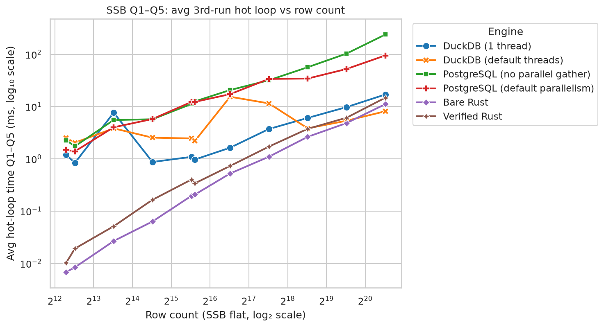

# Lemma

Verified query synthesis: SQL is transpiled to a Dafny spec, an agent (or mock) writes an optimized `RunQuery`, Dafny/Z3 proves correctness, and the result is compiled to native Rust. Contains a DuckDB extension where optimized binaries are cached and invoked on rerun.

https://github.com/user-attachments/assets/7f7891c7-5ef6-406b-882b-8e01134ed37c

## What It Does

1. A SQL query is **deterministically transpiled** into a mathematical `MethodSpec` in Dafny — the ground truth.
2. The Lemma optimizer uses an agent (or mock mode) to write an optimized `method RunQuery`.
3. Dafny/Z3 formally proves that the agent's output satisfies `MethodSpec`.
4. The verified Dafny is translated to Rust and post-processed for native performance.*
5. The code is compiled and executed.
6. Successful optimized binaries are **cached** and loaded via the DuckDB extension.

* Post-processing rewrites and a few assumptions in the Dafny spec are added for performance. These manipulations should match verified Dafny semantics, but that is only verified empirically; see `research_loop/COMPILATION_GUIDE.md`.

---

## Quick Start

One-time setup, then run the interactive demo:

```bash
make install
./scripts/build_ssb_flat_dataset.sh   # one-time: real ssb-dbgen flat table (~6M rows on disk)
./scripts/demo.sh                     # builds extension if needed, prepares data, opens DuckDB CLI
```

In the DuckDB shell, try Lemma on a query (see the on-screen instructions), e.g.:

```sql
SELECT lemma('SELECT SUM(LO_EXTENDEDPRICE * LO_DISCOUNT) FROM lineorder_flat WHERE ...');
```

`demo.sh` handles extension build, dataset loading (`prepare_data`), and launching DuckDB — you do not need to run those steps separately. The flat table only needs to be built once via `build_ssb_flat_dataset.sh`; after that, `prepare_data` runs automatically whenever you start the demo or the lower-level launcher.

**No agent / offline:** `./scripts/mockdemo.sh` — same UX with a pre-seeded RunQuery (no LLM).

**Lower-level launcher** (DuckDB shell only, no demo UI): `make extension` then `./scripts/duckdb_shell.sh`

### Requirements
- [uv](https://docs.astral.sh/uv/) — Python package manager
- [Dafny 4.x](https://github.com/dafny-lang/dafny) — in `PATH`
- [Rust/Cargo](https://rustup.rs/) — for native compilation
- [DuckDB CLI](https://duckdb.org/) — vendored to `build/duckdb` on first launcher run
- [Cursor Agent CLI](https://cursor.com/docs/agent/cli) — `agent` on `PATH` (for `./scripts/demo.sh`; other agents work too if you set `AGENT_CMD` in `research_loop/config.env`)

---

## Results

Scaling benchmark on the SSB flat table (`lineorder_flat`): Q1–Q5 hot-loop latency (3rd timed run) vs row count (log₂ x-axis, log₁₀ y-axis), comparing DuckDB, PostgreSQL, bare Rust, and verified+postprocessed Rust. Full methodology and raw numbers are in `data/benchmarks/scaling_results.json`.



Reproduce:

```bash
uv run python research_loop/benchmark_scaling.py
uv run python research_loop/benchmark_verified.py   # single-point check at 50k rows
```

At 50k rows, verified Rust matches DuckDB on correctness and is competitive on simple scans; at 1.5M rows group-by queries remain the hard case. See `design_docs/writeup_plan.md` for the compilation pipeline performance story.
