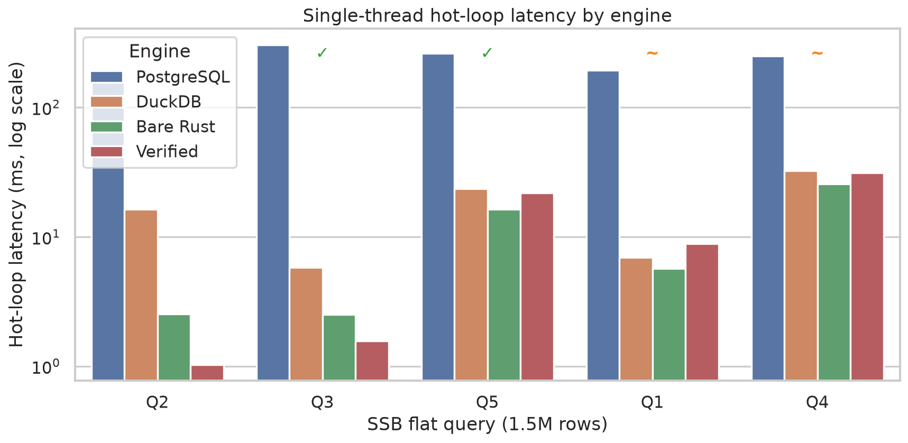

# Lemma

Verified query synthesis: SQL is transpiled to a Dafny spec, an agent (or mock) writes an optimized `RunQuery`, Dafny (Z3) proves correctness, and the result is compiled to native Rust. Contains a DuckDB extension where optimized binaries are cached and invoked on rerun (WIP).

https://github.com/user-attachments/assets/7f7891c7-5ef6-406b-882b-8e01134ed37c

## Pipeline steps

1. SQL query is deterministically transpiled into a formal `MethodSpec` in Dafny, this is GT.
2. AI agent writes optimized Dafny `method RunQuery`.
3. Dafny formally proves that the agent's output satisfies `MethodSpec`.
4. Verified Dafny is translated to Rust, we use some post-processing for native performance.*
5. Code is compiled and executed.
6. Optimized binaries are cached and loaded in on repeat queries via the DuckDB extension (working, but unpolished).

* Post-processing rewrites and a few assumptions in the Dafny spec are added for performance. These manipulations should match verified Dafny semantics, but that is only verified empirically; see `research_loop/COMPILATION_GUIDE.md`.

---

## Quick Start

```bash
./scripts/setup.sh          # tools + Python deps + ssb-dbgen clone
./scripts/demo.sh           # dataset + extension + DuckDB CLI (needs agent CLI)
# or, no LLM:
./scripts/mockdemo.sh       # pre-seeded RunQuery; still needs Dafny + Rust for first compile
```

First run builds SSB flat data (~2M rows, several minutes) and downloads DuckDB CLI. First `SELECT lemma(...)` runs Dafny verify + Rust compile (minutes).

Optional: `./scripts/demo.sh --query 1 --rows 50000`. Eager dataset build: `./scripts/setup.sh --with-dataset`.

```sql
SELECT lemma('SELECT SUM(LO_EXTENDEDPRICE * LO_DISCOUNT) FROM lineorder_flat WHERE ...');
```

### Requirements
- [uv](https://docs.astral.sh/uv/) — Python env
- [Dafny 4.x](https://github.com/dafny-lang/dafny) — verification
- [Rust/Cargo](https://rustup.rs/) — native compile
- **g++**, **make**, **git**, **curl**, **unzip** — extension + ssb-dbgen + DuckDB CLI download (Linux x86_64)
- [Cursor Agent CLI](https://cursor.com/docs/agent/cli) — `agent` on PATH for `./scripts/demo.sh` only

---

## Results

Latency on SSB flat (1.5M rows) and TPC-H SF1 (6M rows), running on mid-range 2026 Ryzen 5 Asus Notebook. All engines run single-threaded. Timed metric is hot-loop latency: median of timed query-loop executions after warm-up, with table load outside the timer.



Row counts under query labels on chart.

Optimization wins vary by query structure. Custom Rust is strongest on selective scans and native hash aggregation, circumventing the somewhat fixed overhead of DuckDB’s generic multi-step path. The Dafny step adds a bare Rust; Dafny codegen favors prover-friendly constructs.
