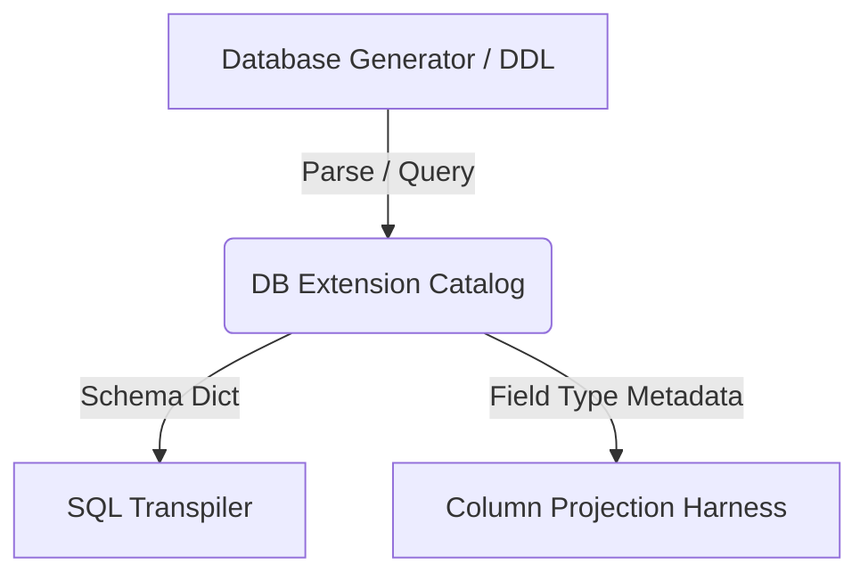

# DB Extension Plan: Dynamic Schema Extraction & Catalog Module

This document outlines the design and implementation plan for a database extension module (`db_extension`). The goal is to eliminate hardcoded, denormalized schema definitions (such as those in `ssb_workload.py`) and replace them with a dynamic database catalog system that extracts schema metadata directly from generator tools, SQL DDL files, or database catalog tables.

---

## 1. Objectives & Motivating Problem

Currently, the SQL-to-Dafny transpiler and verification harness rely on a hardcoded schema dictionary inside the workload configuration file. This introduces several limitations:
* **Coupling:** The compilation and projection harness is tightly coupled to a static set of columns.
* **Maintenance:** Adding new columns, changing data types, or testing new schemas requires manual code edits in the benchmark script.
* **Lack of Sourcing:** The schema structure is not verified against the actual data generator output, risking mismatches if the generator changes.

### The Proposed Solution
A **DB Extension Module** that dynamically inspects the database files, queries database system catalogs, or parses schema files to automatically build the schema representations required by the transpiler.

---

## 2. Proposed Architecture

The extension will consist of three main components:



### A. Schema Sources
The catalog will support multiple ways of discovering table schemas:
1. **DuckDB Catalog Reader:** Inspects the active DuckDB instance or database file (e.g., querying `INFORMATION_SCHEMA.COLUMNS`).
2. **DDL Parser:** Parses standard SQL DDL files (e.g., `create_flat_table.sql`) using a lightweight parser to extract column definitions.
3. **SSB Data Generator inspector:** Queries or infers schema structures based on the generator tables or metadata output.

### B. Catalog API
A clean, schema-agnostic Python interface to access metadata:
```python
class DatabaseCatalog:
    def __init__(self, database_path: str = None):
        ...
        
    def get_table_schema(self, table_name: str) -> dict[str, str]:
        """Returns column names mapped to types (e.g. {'LO_QUANTITY': 'int'})"""
        ...
        
    def get_primary_keys(self, table_name: str) -> list[str]:
        ...
```

---

## 3. Implementation Steps

### Phase 1: DDL and System Catalog Extraction
* Create the `db_extension/` directory.
* Implement a DuckDB catalog reader that runs a query like:
  ```sql
  SELECT column_name, data_type 
  FROM information_schema.columns 
  WHERE table_name = 'lineorder_flat';
  ```
* Fall back to parsing the original SQL DDL script if the DuckDB instance is not active.

### Phase 2: Schema-Agnostic Harness Integration
* Update `harness.py` to initialize the `DatabaseCatalog`.
* Retrieve schema types dynamically at runtime:
  ```python
  from db_extension import DatabaseCatalog
  catalog = DatabaseCatalog()
  schema = catalog.get_table_schema("lineorder_flat")
  ```

### Phase 3: Support for Multi-Table / Normalized Schemas
* Extend the catalog to map foreign keys and primary keys.
* Prepare for the next step of transpiler evolution: supporting SQL joins and multi-table queries by exposing normalized schema relations to the transpiler.
